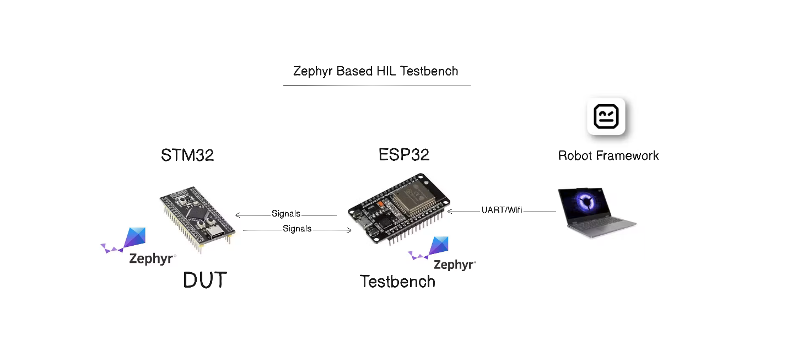

# ZephyrHIL — Zephyr Based HIL Testbench

A Hardware-in-the-Loop testbench for automated validation of embedded firmware running on STM32 microcontrollers, built on Zephyr RTOS.



---

## Table of Contents

- [What is HIL Testing](#what-is-hil-testing)
- [System Overview](#system-overview)
- [Features](#features)
- [ZTB Protocol](#ztb-protocol)
- [Pin Map](#pin-map)
- [Project Structure](#project-structure)
- [Build and Flash](#build-and-flash)
- [Running Tests](#running-tests)
- [Transport Switching](#transport-switching)
- [DUT3 Full Demo](#dut3-full-demo)
- [Tech Stack](#tech-stack)

---

## What is HIL Testing?

Hardware-in-the-Loop (HIL) testing means running automated tests against real hardware instead of simulations. Instead of writing a software model of your system and testing against that, you connect actual hardware and drive real electrical signals into it.

In this project:
- The **testbench** (ESP32) acts as a signal generator and monitor — it drives GPIO pins, outputs analog voltages, sends UART messages, and generates PWM signals
- The **DUT** (STM32) is the device being tested — it receives those signals, processes them with its firmware, and produces outputs
- **Robot Framework** on a PC sends test commands to the ESP32 and validates that the DUT responded correctly

This catches bugs that simulations miss — timing issues, hardware driver bugs, interrupt conflicts, and analog behavior.

---

## System Overview

```
Robot Framework (PC)
        │
        │  UART (USB cable)  or  WiFi TCP (wireless)
        ▼
   ESP32 DevKit  ──────────────────────────  Zephyr RTOS
        │
        │  GPIO · DAC · UART · SPI · PWM signals
        │
        ▼
   STM32 Black Pill (DUT)  ─────────────────  Zephyr RTOS
```

| Board | Role | OS |
|-------|------|----|
| ESP32 DevKit | Testbench — drives and reads all signals | Zephyr RTOS |
| STM32F401CC Black Pill | DUT — firmware being validated | Zephyr RTOS |

The ESP32 runs a TCP/UART server that receives ZTB protocol frames from the PC. It parses each command, calls the appropriate service (GPIO, DAC, UART, SPI, or PWM), drives the physical hardware, and sends a structured response back to Robot Framework.

---

## Features

### Testbench Peripherals (ESP32)

| Resource | Pin | Direction | Description |
|----------|-----|-----------|-------------|
| DIO_OUT1 | GPIO27 | Output | Digital stimulus 1 |
| DIO_OUT2 | GPIO13 | Output | Digital stimulus 2 |
| DIO_IN1 | GPIO14 | Input | Digital monitor 1 |
| DIO_IN2 | GPIO22 | Input | Digital monitor 2 |
| DAC_OUT1 | GPIO25 | Output | Analog voltage 0–3.3V |
| DAC_OUT2 | GPIO26 | Output | Analog voltage 0–3.3V |
| UART TX | GPIO17 | Output | UART to DUT |
| UART RX | GPIO16 | Input | UART from DUT |
| SPI CS | GPIO5 | Output | SPI chip select |
| SPI SCK | GPIO18 | Output | SPI clock |
| SPI MOSI | GPIO23 | Output | SPI data out |
| SPI MISO | GPIO19 | Input | SPI data in |
| PWM_OUT1 | GPIO32 | Output | PWM stimulus (LEDC, 1Hz–100kHz) |
| PWM_IN1 | GPIO4 | Input | PWM capture channel 1 |
| PWM_IN2 | GPIO2 | Input | PWM capture channel 2 |

### Transport
- **UART** — USB serial at 115200 baud, plug and play
- **WiFi TCP** — wireless TCP server on port 5000, no cable needed after first flash
- **Runtime switching** — send a ZTB command to switch transport and reboot, choice saved in flash

### Test Automation
- Robot Framework test suites for every peripheral
- Custom Python libraries: `TestbenchSerial.py` (UART) and `TestbenchWifi.py` (WiFi)
- Identical test cases work over both transports — only the library changes

---

## ZTB Protocol

All communication uses ZTB (Zephyr Testbench) — a simple line-based text protocol. Each frame is one line ending with `\r\n`.

### Frame Format

```
ZTB|seq=<N>|cmd=<COMMAND>|<key>=<value>|<key>=<value>
```

- `seq` — sequence number, matched in the response so Robot Framework knows which response belongs to which command
- `cmd` — the command to execute
- remaining fields — command-specific parameters

### Response Format

```
ZTB|seq=<N>|status=OK|<key>=<value>
ZTB|seq=<N>|status=FAIL|err=<ERROR_CODE>
```

### Examples

**GPIO write:**
```
→ ZTB|seq=1|cmd=GPIO_WRITE|ch=DIO_OUT1|val=1
← ZTB|seq=1|status=OK
```

**DAC output:**
```
→ ZTB|seq=2|cmd=DAC_WRITE|ch=DAC_OUT1|mv=1650
← ZTB|seq=2|status=OK
```

**UART send and expect:**
```
→ ZTB|seq=3|cmd=UART_SEND_EXPECT|ch=UART_CH1|tx=PING|expect=PONG|timeout=1000
← ZTB|seq=3|status=OK|rx=PONG
```

**PWM write:**
```
→ ZTB|seq=4|cmd=PWM_WRITE|ch=PWM_OUT1|frequency=100|duty_cycle=75
← ZTB|seq=4|status=OK|freq_set=100|duty_set=75
```

**PWM capture and validate:**
```
→ ZTB|seq=5|cmd=PWM_READ_WITH_TOLERANCE|ch=PWM_IN1|frequency=100|duty_cycle=75|freq_tol_pct=5|duty_tol_pp=2|timeout=2000
← ZTB|seq=5|status=OK|freq_expected=100|duty_expected=75|freq_measured=101|duty_measured=74|freq_tol_pct=5|duty_tol_pp=2
```

**SPI write with GPIO validation:**
```
→ ZTB|seq=6|cmd=SPI_WRITE|tx=LED_ON
← ZTB|seq=6|status=OK
→ ZTB|seq=7|cmd=GPIO_EXPECT|ch=DIO_IN2|val=1|timeout=500
← ZTB|seq=7|status=OK|expected=1|actual=1
```

**Transport switch:**
```
→ ZTB|seq=8|cmd=TRANSPORT_SWITCH|mode=WIFI
← ZTB|seq=8|status=OK
[ESP32 reboots and connects to WiFi]
```

### Command Reference

| Command | Key Parameters | Description |
|---------|---------------|-------------|
| `GPIO_WRITE` | `ch`, `val` | Drive a GPIO pin HIGH (1) or LOW (0) |
| `GPIO_READ` | `ch` | Read current GPIO pin state |
| `GPIO_EXPECT` | `ch`, `val`, `timeout` | Wait for GPIO to reach expected value |
| `DAC_WRITE` | `ch`, `mv` | Output analog voltage in millivolts |
| `UART_WRITE` | `ch`, `tx` | Send string over UART |
| `UART_READ` | `ch`, `timeout` | Read string from UART |
| `UART_SEND_EXPECT` | `ch`, `tx`, `expect`, `timeout` | Send and validate UART response |
| `PWM_WRITE` | `ch`, `frequency`, `duty_cycle` | Generate PWM signal |
| `PWM_READ_WITH_TOLERANCE` | `ch`, `frequency`, `duty_cycle`, `freq_tol_pct`, `duty_tol_pp`, `timeout` | Capture and validate PWM |
| `SPI_WRITE` | `tx` | Send command byte to SPI slave |
| `SPI_SEND_EXPECT` | `tx`, `expect` | Full-duplex SPI with response validation |
| `TRANSPORT_SWITCH` | `mode` | Switch to UART or WIFI and reboot |

---

## Pin Map

### DUT3 — STM32F401CC to ESP32 Connections

| STM32 Pin | ESP32 Pin | Signal | Function |
|-----------|-----------|--------|----------|
| PB0 | GPIO27 | DIO_OUT1 → | Switch input |
| PB1 | GPIO14 | ← DIO_IN1 | LED output |
| PA0 | GPIO25 | DAC_OUT1 → | Fan speed ADC |
| PA3 | GPIO17 | UART TX → | USART2 RX |
| PA2 | GPIO16 | ← UART RX | USART2 TX |
| PA4 | GPIO5 | SPI CS → | SPI1 NSS |
| PA5 | GPIO18 | SPI SCK → | SPI1 SCK |
| PA7 | GPIO23 | SPI MOSI → | SPI1 MOSI |
| PB4 | GPIO32 | PWM_OUT1 → | TIM3 input |
| PA8 | GPIO4 | ← PWM_IN1 | TIM1 fan PWM |
| PB10 | GPIO2 | ← PWM_IN2 | TIM2 match PWM |
| PB5 | GPIO22 | ← DIO_IN2 | SPI command LED |

---

## Project Structure

```
ZephyrHIL/
├── firmware/
│   │
│   ├── dut_stm32/                  DUT1 — GPIO, DAC, UART validation
│   │   └── src/
│   │       ├── dio_app.c           GPIO mirror and stimulus
│   │       ├── adc_app.c           ADC read from DAC voltage
│   │       └── uart_app.c          UART receive and respond
│   │
│   ├── dut_stm32_2/                DUT2 — PWM and SPI validation
│   │   └── src/
│   │       └── spi_slave.c         SPI slave receive
│   │
│   ├── dut_stm32_3/                DUT3 — Full demo, all peripherals
│   │   └── src/
│   │       ├── main.c              Init all modules, main loop
│   │       ├── switch_led.c        PB0 input mirrors to PB1 output
│   │       ├── fan_pwm.c           ADC PA0 → TIM1 PWM duty at 1kHz
│   │       ├── uart_echo.c         USART2 interrupt-driven echo
│   │       ├── pwm_match.c         Capture PB4 → reproduce on PB10
│   │       └── spi_cmd.c           SPI1 slave → drive PB5 HIGH/LOW
│   │
│   └── testbench_esp32/            ESP32 testbench firmware
│       └── src/
│           ├── main.c              Boot, transport selection, ZTB loop
│           ├── uart_transport.c    UART read/write line
│           ├── wifi_transport.c    WiFi TCP server read/write line
│           ├── ztb_protocol.c      Frame parser and response formatter
│           ├── test_executor.c     Routes commands to services
│           ├── gpio_service.c      GPIO write/read/expect
│           ├── dac_service.c       DAC voltage output
│           ├── uart_service.c      UART send/receive to DUT
│           ├── pwm_service.c       LEDC output + GPIO interrupt capture
│           ├── spi_service.c       SPI master write and loopback
│           └── board_map.c         Logical name to physical pin mapping
│
├── robot_tests/
│   ├── libraries/
│   │   ├── TestbenchSerial.py      UART transport library
│   │   └── TestbenchWifi.py        WiFi TCP transport library
│   ├── resources/
│   │   ├── common_keywords.robot
│   │   └── common_keywords_wifi.robot
│   └── tests/
│       ├── 01_gpio_tests.robot     DUT1 — GPIO tests
│       ├── 02_pwm_test.robot       DUT2 — PWM tests
│       ├── 03_spi_test.robot       DUT2 — SPI tests
│       ├── 04_adc_dac_tests.robot  DUT1 — ADC/DAC tests
│       ├── 05_dac_out2_tests.robot DUT1 — DAC channel 2 tests
│       ├── 06_uart_tests.robot     DUT1 — UART tests
│       ├── 08_dut3_demo.robot      DUT3 — Full demo, 11 test cases
│       └── 09_wifi_regression.robot WiFi transport regression
│
├── docs/                           Architecture, wiring, protocol docs
│   └── saleae_validation/          Logic analyzer captures for validation
│
├── scripts/
│   ├── switch_to_uart.py           Switch ESP32 to UART mode over WiFi
│   └── switch_to_wifi.py           Switch ESP32 to WiFi mode over UART
│
└── results/                        Robot Framework test reports
    ├── log.html
    ├── output.xml
    └── report.html
```

### DUT Progression

| DUT | Board | Purpose |
|-----|-------|---------|
| DUT1 | STM32 Black Pill | Validate GPIO, DAC, and UART services individually |
| DUT2 | STM32 Black Pill | Validate PWM output/capture and SPI slave |
| DUT3 | STM32 Black Pill | Full demo — all peripherals running simultaneously |

---

## Build and Flash

### Prerequisites

```bash
# Activate Zephyr virtual environment
source ~/zephyrproject/.venv/bin/activate
```

### ESP32 Testbench

```bash
west build -b esp32_devkitc/esp32/procpu \
    firmware/testbench_esp32 \
    -d firmware/testbench_esp32/build

west flash -d firmware/testbench_esp32/build
```

On first boot, connect picocom and select transport:
```
ZTB|status=BOOT
Select transport:
  1 = UART
  2 = WIFI
```

### STM32 DUT3

```bash
west build -b blackpill_f401cc \
    firmware/dut_stm32_3 \
    -d firmware/dut_stm32_3/build

west flash -d firmware/dut_stm32_3/build --runner openocd
```

---

## Running Tests

### Install Robot Framework

```bash
pip install robotframework pyserial
```

### UART Mode

```bash
cd robot_tests
robot tests/08_dut3_demo.robot
```

### WiFi Mode

```bash
cd robot_tests
robot tests/09_wifi_regression.robot
```

### Full Test Suite

```bash
robot tests/
```

---

## Transport Switching

The ESP32 supports two transport modes. The choice is stored in flash and survives reboots.

**First boot** — a menu appears over UART for 5 seconds:
```
ZTB|status=BOOT
Select transport:
  1 = UART
  2 = WIFI
Waiting 5 seconds...
```

Type `1` or `2`. After that, the board always boots into the saved mode automatically.

**Switch to WiFi** (while in UART mode):
```bash
python3 scripts/switch_to_wifi.py
```
ESP32 connects to WiFi and prints its IP:
```
ZTB|transport=WIFI|ip=192.168.0.85|port=5000
ZTB|status=READY
```

**Switch to UART** (while in WiFi mode, over TCP):
```bash
python3 scripts/switch_to_uart.py
```

**Switch via ZTB command directly:**
```
ZTB|seq=1|cmd=TRANSPORT_SWITCH|mode=WIFI
ZTB|seq=1|cmd=TRANSPORT_SWITCH|mode=UART
```

---

## DUT3 Full Demo

DUT3 is a single STM32F401CC board wired to the ESP32 testbench, running multiple firmware modules simultaneously to simulate a real embedded device.

### DUT3 Firmware Modules

| Module | File | Behavior |
|--------|------|----------|
| Switch/LED | `switch_led.c` | PB0 input mirrors to PB1 output |
| Fan controller | `fan_pwm.c` | ADC on PA0 → PWM duty on PA8 at 1kHz |
| UART echo | `uart_echo.c` | Interrupt-driven echo on USART2 |
| PWM match | `pwm_match.c` | Captures PB4 → reproduces on PB10 |
| SPI command | `spi_cmd.c` | Receives byte → drives PB5 HIGH/LOW |

### Test Results

| # | Test Case | Stimulus | Validation | Result |
|---|-----------|----------|------------|--------|
| 001 | Switch ON | GPIO27 HIGH | GPIO14 HIGH | ✅ PASS |
| 002 | Switch OFF | GPIO27 LOW | GPIO14 LOW | ✅ PASS |
| 003 | Fan 50% | DAC 1650mV | PWM_IN1 1kHz 50% | ✅ PASS |
| 004 | Fan 91% | DAC 3000mV | PWM_IN1 1kHz 91% | ✅ PASS |
| 005 | Fan 15% | DAC 500mV | PWM_IN1 1kHz 15% | ✅ PASS |
| 006 | UART PING | Send PING | Receive PING | ✅ PASS |
| 007 | UART HELLO | Send HELLO | Receive HELLO | ✅ PASS |
| 008 | SPI LED ON | SPI 0x01 | GPIO22 HIGH | ✅ PASS |
| 009 | SPI LED OFF | SPI 0x00 | GPIO22 LOW | ✅ PASS |
| 011 | PWM Match 100Hz | PWM_OUT1 100Hz 50% | PWM_IN2 100Hz 50% | ✅ PASS |
| 012 | PWM Match 200Hz | PWM_OUT1 200Hz 75% | PWM_IN2 200Hz 75% | ✅ PASS |

**11 / 11 PASSING**

---

## Tech Stack

| Category | Technology |
|----------|------------|
| Firmware | C · Zephyr RTOS |
| Microcontrollers | ESP32 · STM32F401CC |
| Test Automation | Robot Framework · Python |
| Debugging | OpenOCD · West · picocom |
| Communication | UART · WiFi TCP · SPI · PWM · DAC · GPIO |


