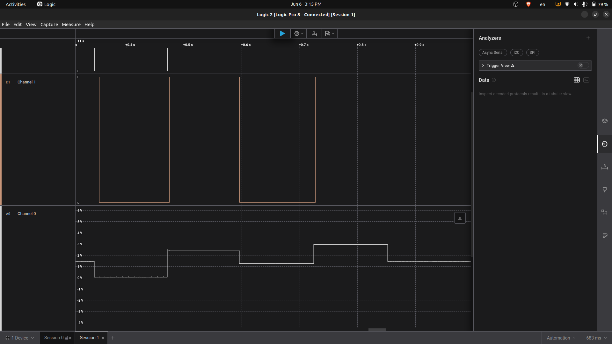

# ADC/DAC Saleae Validation

## Objective

Validate the ADC/DAC end-to-end behavior using Saleae Logic Pro 8.

This validation shows that the ESP32 DAC output generates an analog voltage level, and the STM32 DUT reacts to that voltage through its ADC threshold logic.

## Wiring

| Saleae Channel | Connected Signal               |
| -------------- | ------------------------------ |
| A0             | ESP32 GPIO25 / DAC_OUT1        |
| D1             | STM32 PB5 / ADC warning output |
| GND            | Common GND                     |

ADC/DAC E2E wiring:

```text
ESP32 GPIO25 / DAC_OUT1 -> STM32 PA0 / ADC_IN
STM32 PB5 / WARNING_OUT -> ESP32 GPIO22 / DIO_IN2
ESP32 GND               -> STM32 GND
```

## Test Commands

Manual DAC stimulus commands were used to make the analog transition clear in Saleae:

```text
ZTB|seq=300|cmd=DAC_WRITE|ch=DAC_OUT1|mv=0
ZTB|seq=301|cmd=DAC_WRITE|ch=DAC_OUT1|mv=2500
ZTB|seq=302|cmd=DAC_WRITE|ch=DAC_OUT1|mv=0
```

Robot ADC test:

```bash
robot -d reports robot_tests/tests/04_adc_dac_tests.robot
```

## Expected Behavior

```text
DAC_OUT1 low voltage  -> STM32 PB5 LOW
DAC_OUT1 high voltage -> STM32 PB5 HIGH
DAC_OUT1 low voltage  -> STM32 PB5 LOW
```

## Result

The Saleae capture shows the DAC analog voltage changing on A0, and the STM32 ADC warning output changing on D1 according to the configured ADC threshold.

Result: PASSED

## Capture


