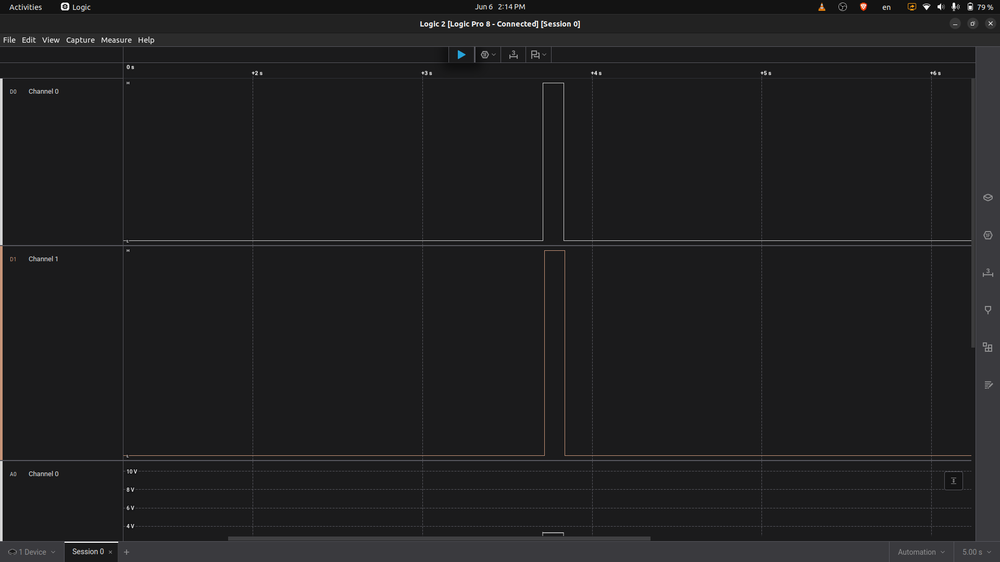

# DIO Saleae Validation

## Objective

Validate the DIO end-to-end behavior using Saleae Logic Pro 8.

## Wiring

| Saleae Channel | Connected Signal        |
| -------------- | ----------------------- |
| D0             | ESP32 GPIO27 / DIO_OUT1 |
| D1             | STM32 PB1 / DUT output  |
| GND            | Common GND              |

DIO E2E wiring:

```text
ESP32 GPIO27 / DIO_OUT1 -> STM32 PB0
STM32 PB1              -> ESP32 GPIO14 / DIO_IN1
ESP32 GND              -> STM32 GND
```

## Test Command

```bash
robot -d reports robot_tests/tests/01_gpio_tests.robot
```

## Expected Behavior

```text
DIO_OUT1 HIGH -> STM32 PB1 HIGH
DIO_OUT1 LOW  -> STM32 PB1 LOW
```

## Result

The Saleae capture shows both D0 and D1 transitioning HIGH and LOW during the Robot Framework DIO test.

Result: PASSED

## Capture


