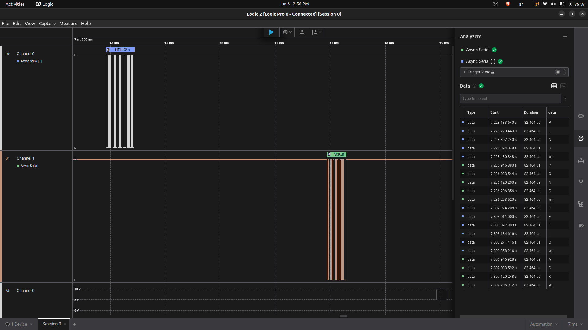

# UART Saleae Validation

## Objective

Validate the UART end-to-end behavior using Saleae Logic Pro 8 and Async Serial decoding.

## Wiring

| Saleae Channel | Connected Signal                  |
| -------------- | --------------------------------- |
| D0             | ESP32 GPIO17 / TXD2 / UART_CH1_TX |
| D1             | STM32 PA2 / USART2_TX             |
| GND            | Common GND                        |

UART E2E wiring:

```text
ESP32 GPIO17 / TXD2 -> STM32 PA3 / USART2_RX
STM32 PA2 / USART2_TX -> ESP32 GPIO16 / RXD2
ESP32 GND -> STM32 GND
```

## Saleae Analyzer Settings

```text
Analyzer: Async Serial
Baudrate: 115200
Data bits: 8
Parity: None
Stop bits: 1
Signal inversion: Non-inverted
Display: ASCII
```

## Test Command

```bash
robot -d reports robot_tests/tests/06_uart_tests.robot
```

## Expected Behavior

```text
ESP32 -> STM32: PING
STM32 -> ESP32: PONG

ESP32 -> STM32: HELLO
STM32 -> ESP32: ACK
```

## Result

The Saleae capture shows UART traffic decoded successfully during the Robot Framework UART tests.

Result: PASSED

## Capture


